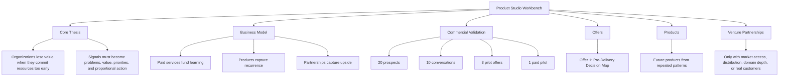
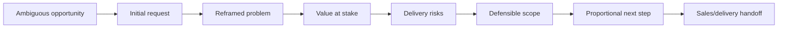
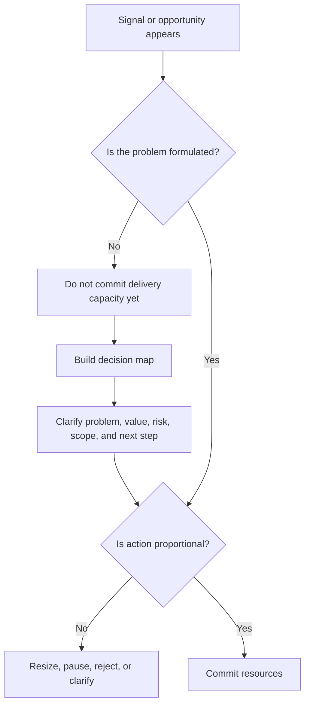
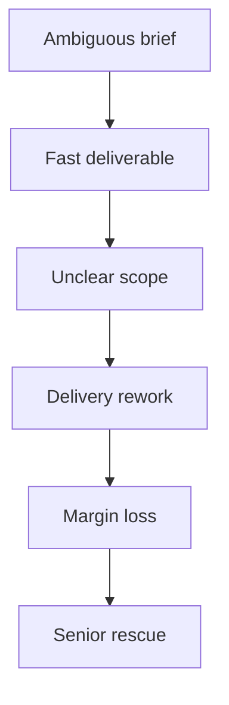

# Studio Visual Map

This page gives a fast visual overview of the studio logic.

## Studio Architecture

## First Commercial Experiment

## Decision Boundary

## What The Studio Must Avoid

The studio should not become a machine for turning ambiguous briefs into fast deliverables.

